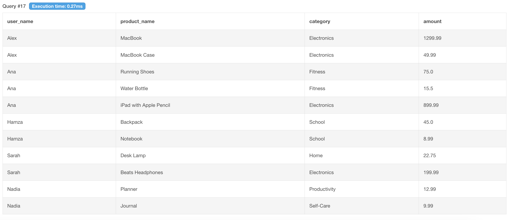
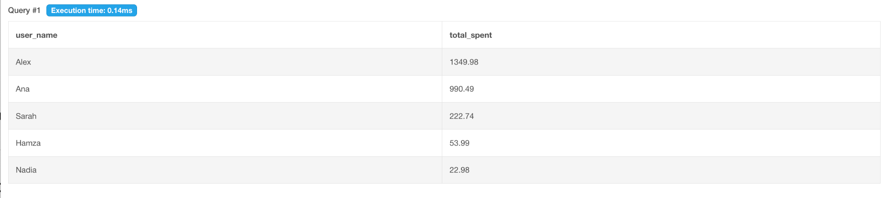

# User-spending-behavior-analysis
SQL project analyzing user spending behavior using joins and aggregation to identify trends and high-value users.

## User Purchases Overview

This query displays all user transactions by joining the Users and Purchases tables.

## Total Spending Per User

This query calculates the total amount spent by each user, helping identify high-value users.

